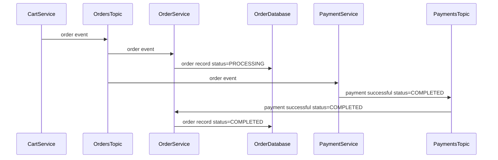

# Hybrid Cloud Coolstore Demo

## Multicluster

### Multicluster Installation

01. Provision an `OCP4 ACM Hub` cluster on `demo.redhat.com`

01. Login to the ACM Hub Cluster as a `cluster-admin` using `oc login`

01. Install services to the ACM Hub Cluster - this will: install the OpenShift GitOps operator, install `gitea`, upload manifests to `gitea`, setup a `coolstore` Application that points to the manifests in `gitea` (app-of-apps pattern)

		make install

01. Create credentials for AWS named `aws` in the `open-cluster-management` namespace in the OpenShift Console - All Clusters / Credentials / Add credential

01. Create a `clusterset` named `coolstore` - All Clusters / Infrastructure / Clusters / Cluster sets

	* Create a namespace binding to `openshift-gitops`
            ```
            ---
            apiVersion: cluster.open-cluster-management.io/v1beta2
            kind: ManagedClusterSetBinding
            metadata:
              name: coolstore
              namespace: openshift-gitops
            spec:
              clusterSet: coolstore
            ```

01. Create 3 AWS clusters in the `coolstore` clusterset

	*   NOTE: Cluster creation documentation can be found at `https://access.redhat.com/documentation/en-us/red_hat_advanced_cluster_management_for_kubernetes/2.7/html/clusters/cluster_mce_overview#creating-a-cluster`

	*   Create an AWS cluster in the `coolstore` clusterset named `coolstore-a`
	*   Cluster `coolstore-a` should be in the AWS region `ap-southeast-1` and has at least 1 worker node deployed in `ap-southeast-1a`

		|Network|CIDR|
		|---|---|
		|Node pools / Worker pool 1 / Node count|`4`|
		|Cluster network|`10.128.0.0/14`|
		|Service network|`172.30.0.0/16`|

	*   Create an AWS cluster in the `coolstore` clusterset named `coolstore-b`
	*   Cluster `coolstore-b` should be in the AWS region `eu-central-1` and has at least 1 worker node deployed in `eu-central-1a`

		|Network|CIDR|
		|---|---|
		|Cluster network|`10.132.0.0/14`|
		|Service network|`172.31.0.0/16`|

	*   Create an AWS cluster in the `coolstore` clusterset named `coolstore-c`
	*   Cluster `coolstore-c` should be in the AWS region `us-east-1` and has at least 1 worker node deployed in `us-east-1a`

		|Network|CIDR|
		|---|---|
		|Cluster network|`10.140.0.0/14`|
		|Service network|`172.32.0.0/16`|

01. After all 3 clusters have been provisioned, edit the `coolstore` clusterset and install Submariner add-ons in all clusters

01. Wait for the submariner add-ons to complete installation on all nodes

01. NOTE: If you have deployed the clusters in other AWS regions, or have deployed them on other public cloud providers such as Azure and GCP, then you will need to update the overlays folders in gitea

	*   For instance, if `coolstore-a` is deployed in `ap-southeast-2` instead of `ap-southeast-1`, then you will need to
		* Update `coolstore/yugabyte/overlays/multi-cluster/coolstore-a/kustomization.yaml`
	        	* Perform search and replace of the value `ap-southeast-1` with `ap-southeast-2`
	        	* Make the required changes to the availability zone, if need be
	        	* Note that changes can either be done from the Gitea UI or via git commands
	        	* Note that the default login credentials for Gitea is `demo / password`
	        	* Commit and push all changes to Gitea
	*   Ensure appropriate changes are made to the override YAML files for the other clusters, if need be

01. Setup ArgoCD `ApplicationSet`s

		oc apply -f yaml/argocd/coolstore.yaml

01. Add banners to the OpenShift Consoles so you know which cluster you're on - do this for the hub cluster, `coolstore-a`, `coolstore-b`, `coolstore-c`

		./scripts/setup-console-banners

01. Modify the `coolstore-a` alert manager settings so that alert emails are sent quicker

		./scripts/modify-alert-manager-settings

01. Open the following browser tabs

	* ArgoCD
		* `make argocd-password` to get the `admin` password
		* `make argocd` will open a browser to ArgoCD - login as `admin`

	* `gitea` - `make gitea`, login as `demo` / `password`

	* `coolstore-a` OpenShift Console topology view in the `demo` project

	* `coolstore-b` OpenShift Console topology view in the `demo` project

	* `coolstore-ui` - `make coolstore-ui` to open a browser; note that we're using HTTP to access `coolstore-ui` - if your browser don't recognize the OpenShift Router's certificate and you try to access `coolstore-ui` over HTTPS, then you won't be able to access some services

	* `maildev` - `make email`
		* Turn on notifications so you see the alert email coming in
		* If you are using Google Chrome, you may need to view site information and explicitly allow notifications - don't forget to reload the page after enabling notifications


### Multicluster Demo

01. Switch to the ArgoCD browser tab - walk through all the services deployed to the `coolstore-a` cluster in the Applications screen

01. Switch to the `gitea` browser tab - walk through the manifests in gitea, starting with the `argocd` directory

01. Switch to the `coolstore-a` OpenShift Console browser tab and open the `demo` project's  topology view; point out how `payment` is deployed as a serverless component

01. Test the demo app

	* Switch to the `coolstore-ui` browser tab
	* Add an item to the shopping cart
	* Select `Cart` / `Checkout`
	* Enter your details and click `Checkout` - [ensure that your credit card number starts with `4`](https://github.com/RedHat-Middleware-Workshops/cloud-native-workshop-v2-labs-solutions/blob/c32daed7aa7c803b1a29fbe56be350bf4a5e6be2/m4/payment-service/src/main/java/com/redhat/cloudnative/PaymentResource.java#L61)
	* Select the `Orders` tab - you should see a new order with a payment status of `PROCESSING`
	* If you look at the Topology View, you should see the `payment` Knative service spinning up
	* After a few seconds, reload the orders page, and the order's payment status should be set to `COMPLETED`

01. Switch to the QR code tab, and invite the audience to submit their own orders

01. Explain how the strategy has changed from a single cloud to multi-cloud

01. Spin up an additional `payment` service on `coolstore-b`

	* Switch to the `gitea` browser tab

	* Edit `argocd/yaml/payment.yaml`, duplicate `.spec.generators[0].list.elements[0]`, with the new element's `cluster` set to `coolstore-b`

			...
			spec
			  generators:
			  - list:
			      elements:
			       - cluster: coolstore-a
			         values:
			           namespace: demo
			       - cluster: coolstore-b
			         values:
			           namespace: demo

01. Switch to the `coolstore-b` OpenShift Console topology view - you should see the `payment` service spinning up; if you don't see the `payment` service coming up on `coolstore-b`, switch to the ArgoCD web UI and refresh the `coolstore` application

01. Switch to the `coolstore-ui` orders screen - you should see the orders being processed


### Cleaning Up

Before you destroy the clusters, uninstall submariner from `coolstore-a` and `coolstore-b`

If you don't do the above, the clusters may be stuck in the detaching phase. If this happens to you, [refer to this article](https://access.redhat.com/solutions/6243371).

---

## Single Cluster Installation

01. Provision an OpenShift 4.12 workshop cluster on `demo.redhat.com`

01. Login to the cluster as a `cluster-admin`

01. Install the OpenShift GitOps operator and `gitea`

		make install

01. ArgoCD will be installing operators in the connected cluster, so we will need to assign it the proper privileges

		cat <<EOF | oc apply -f -
		apiVersion: rbac.authorization.k8s.io/v1
		kind: ClusterRoleBinding
		metadata:
		  name: argocd-cluster-admin
		roleRef:
		  apiGroup: rbac.authorization.k8s.io
		  kind: ClusterRole
		  name: cluster-admin
		subjects:
		- kind: ServiceAccount
		  name: openshift-gitops-argocd-application-controller
		  namespace: openshift-gitops
		EOF

01. Add the `Application` resource

		oc apply -f yaml/single-cluster/coolstore.yaml

The manifests in the `single-cluster` folder differ from the manifests in the `argocd` folder in the following ways:

* The `Application` destination names (`.spec.destination.name`) have been set to `in-cluster` instead of `coolstore-a` and `coolstore-b`

* `kafka.yaml` has been modified - `.kafka.serviceexport` in `.spec.template.spec.source.helm` is set to `false`

* `payment.yaml` has been modified - `.payment.kafka.bootstrapServers` in `.spec.template.spec.source.helm` is set to `my-cluster-kafka-bootstrap.demo.svc.cluster.local:9092`

* Cart's Infinispan is setup to deploy a single instance without cross-site replication


## Troubleshooting

*   If you have trouble connecting to Kafka from the remote cluster, spin up a test Kafka pod to access `my-cluster-kafka-bootstrap.demo.svc.clusterset.local`

		apiVersion: v1
		kind: Pod
		metadata:
		  creationTimestamp: null
		  labels:
		    run: client
		  name: client
		spec:
		  containers:
		  - command:
		    - tail
		    - -f
		    - /dev/null
		    image: registry.redhat.io/amq7/amq-streams-kafka-31-rhel8@sha256:c113eefe89a40c96e190a24bcdf1b0823865e3c80ffb883bc8ed4b7bb2661df6
		    name: client
		    resources: {}
		  dnsPolicy: ClusterFirst
		  restartPolicy: Always


## Checkout Process




## Resources

*   [Solution git repo](https://github.com/RedHat-Middleware-Workshops/cloud-native-workshop-v2-labs-solutions/tree/ocp-4.9/m4)

*   [Lab instructions](http://guides-m4-labs-infra.6923.rh-us-east-1.openshiftapps.com/workshop/cloudnative/lab/high-performing-cache-services)

*   [Strimzi advertised addresses](https://strimzi.io/docs/operators/latest/configuring.html#property-listener-config-broker-reference)

*   Access cart swagger UI at `/q/swagger-ui`

*   Access cart contents

		curl -i http://cart.url.com/api/cart/id-0.0038...

*   List keys in Infinispan

		curl \
		  -i \
		  -u user:pass \
		  -H "Accept: application/json" \
		  http://localhost:11222/rest/v2/caches/cart?action=keys \
		&& \
		echo

*   Get all entries in Infinispan

		curl \
		  -i \
		  -u user:pass \
		  -H "Accept: application/json" \
		  http://localhost:11222/rest/v2/caches/cart?action=entries \
		&& \
		echo

*   Force remove all Applications and ApplicationSets from ArgoCD

		oc patch \
		  -n openshift-gitops \
		  --type=json \
		  -p '[{"op":"remove","path":"/metadata/finalizers"}]' \
		  application/coolstore

		oc delete -n openshift-gitops application/coolstore

		for r in $(oc get -n openshift-gitops applicationsets,applications -o name); do
		  oc patch \
		    -n openshift-gitops \
		    --type=json \
		    -p '[{"op":"remove","path":"/metadata/finalizers"}]' \
		    $r
		  oc delete -n openshift-gitops $r --wait=false
		done

*   Test postgresql

		oc run psql \
		  --image image-registry.openshift-image-registry.svc:5000/openshift/postgresql:10-el8 \
		  --command -- tail -f /dev/null

		oc rsh psql \
		  psql \
		    -h yb-tserver-0.coolstore-a.yb-tservers.demo.svc.clusterset.local \
		    -p 5433 \
		    -U yugabyte \
		    -c 'select * from catalog' \
		    catalog
