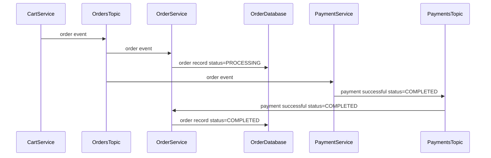

# Hybrid Cloud Coolstore Demo

## Multicluster

### Multicluster Installation

01. Provision an `Red Hat OpenShift Container Platform 4 Red Hat Advanced Cluster Management Hub` cluster on `demo.redhat.com` - if you are planning on deploying clusters to the default regions (`ap-southeast-1`, `ap-southeast-2`, `ap-northeast-1`), ensure that you deploy the ACM Hub cluster to a region other than those 3 to avoid problems with the AWS quotas

01. Download the pull secret to the same directory as this README from the [Hybrid Cloud Console](https://console.redhat.com/openshift/install/pull-secret) - the pull secret should be named `pull-secret.txt`

01. By default, the installer will deploy clusters to `ap-southeast-1`, `ap-southeast-2`, and `ap-northeast-1` - if you wish to deploy the clusters to different regions, edit `config.sh` and change the regions in the `CLUSTER_REGIONS` variable

01. Install services to the ACM Hub Cluster

		make install

	*   This will:

		*   Login to the ACM Hub cluster using `oc login`
		*   Create the AWS credentials in the `open-cluster-management` namespace
		*   Install the OpenShift GitOps operator
		*   Install `gitea`
		*   Upload manifests to `gitea`
		*   Create a Cluster Set named `coolstore`
		*   Create a binding from the `coolstore` Cluster Set to the `openshift-gitops` namespace
		*   Provision 3 OpenShift clusters in different AWS regions
		*   Install the Submariner add-on on the 3 managed clusters
		*   Setup console banners on the OpenShift Console for the ACM Hub and the 3 managed clusters
		*   Setup Let's Encrypt for the 3 managed clusters
		*   Setup the ArgoCD `ApplicationSets`

	*   The script will ask you to paste the contents of the email containing the ACM hub cluster details from RHDP; alternatively, you can retrieve the details by

		*   Logging into [demo.redhat.com](https://demo.redhat.com/)
		*   Selecting Services / OCP4 ACM Hub / Details
		*   Copy the contents of the `Provision Messages` row

	*   After you paste the cluster details, enter Ctrl-D on a new line

	*   The installation process should take about 65 minutes to complete

	*   Note: `make install` will run the install script from your local machine - there is also a [remote install](#remote-install) option where the majority of the installation takes place in a Kubernetes Job on the ACM Hub cluster

01. Modify the `coolstore-a` alert manager settings so that alert emails are sent quicker

		./scripts/modify-alert-manager-settings

01. Configure OpenShift contexts 
	    
	*   Be sure to log into the hub cluster.

			make contexts 

01. Open the following browser tabs

	* ArgoCD
		* `make argocd-password` to get the `admin` password
		* `make argocd` will open a browser to ArgoCD - login as `admin`

	* `gitea` - `make gitea`, login as `demo` / `password`

	* `coolstore-a` OpenShift Console topology view in the `demo` project

	* `coolstore-b` OpenShift Console topology view in the `demo` project

	* `coolstore-ui` - `make coolstore-ui` to open a browser; note that we're using HTTP to access `coolstore-ui` - if your browser don't recognize the OpenShift Router's certificate and you try to access `coolstore-ui` over HTTPS, then you won't be able to access some services

	* `maildev` - `make email`
		* Turn on notifications so you see the alert email coming in
		* If you are using Google Chrome, you may need to view site information and explicitly allow notifications - don't forget to reload the page after enabling notifications

01. Set up F5 Distributed Cloud Global Loadbalancer

	*   Note that you will need to install the following: `yq`, `jinja2` and `vesctl`.

			make f5


### Multicluster Demo

01. Switch to the ArgoCD browser tab - walk through all the services deployed to the `coolstore-a` cluster in the Applications screen

01. Switch to the `gitea` browser tab - walk through the manifests in gitea, starting with the `argocd` directory

01. Switch to the `coolstore-a` OpenShift Console browser tab and open the `demo` project's  topology view; point out how `payment` is deployed as a serverless component

01. Test the demo app

	* Switch to the `coolstore-ui` browser tab
	* Add an item to the shopping cart
	* Select `Cart` / `Checkout`
	* Enter your details and click `Checkout` - [ensure that your credit card number starts with `4`](https://github.com/RedHat-Middleware-Workshops/cloud-native-workshop-v2-labs-solutions/blob/c32daed7aa7c803b1a29fbe56be350bf4a5e6be2/m4/payment-service/src/main/java/com/redhat/cloudnative/PaymentResource.java#L61)
	* Select the `Orders` tab - you should see a new order with a payment status of `PROCESSING`
	* If you look at the Topology View, you should see the `payment` Knative service spinning up
	* After a few seconds, reload the orders page, and the order's payment status should be set to `COMPLETED`

01. Switch to the QR code tab, and invite the audience to submit their own orders

01. Explain how the strategy has changed from a single cloud to multi-cloud

01. Spin up an additional `payment` service on `coolstore-b`

	* Switch to the `gitea` browser tab

	* Edit `argocd/yaml/payment.yaml`, duplicate `.spec.generators[0].list.elements[0]`, with the new element's `cluster` set to `coolstore-b`

			...
			spec
			  generators:
			  - list:
			      elements:
			       - cluster: coolstore-a
			         values:
			           namespace: demo
			       - cluster: coolstore-b
			         values:
			           namespace: demo

01. Switch to the `coolstore-b` OpenShift Console topology view - you should see the `payment` service spinning up; if you don't see the `payment` service coming up on `coolstore-b`, switch to the ArgoCD web UI and refresh the `coolstore` application

01. Switch to the `coolstore-ui` orders screen - you should see the orders being processed


### Cleaning Up

Before you destroy the clusters, uninstall submariner from `coolstore-a` and `coolstore-b`

If you don't do the above, the clusters may be stuck in the detaching phase. If this happens to you, [refer to this article](https://access.redhat.com/solutions/6243371).

---

## Single Cluster Installation

01. Provision an OpenShift 4.12 workshop cluster on `demo.redhat.com`

01. Login to the cluster as a `cluster-admin` using `oc login`

01. Install the OpenShift GitOps operator and `gitea`, setup the ArgoCD `ApplicationSets`

		make install-gitops deploy-gitea create-clusters

The manifests in the `single-cluster` folder differ from the manifests in the `argocd` folder in the following ways:

*   The `Application` destination names (`.spec.destination.name`) have been set to `in-cluster` instead of `coolstore-a` and `coolstore-b`

*   `kafka.yaml` has been modified - `.kafka.serviceexport` in `.spec.template.spec.source.helm` is set to `false`

*   `payment.yaml` has been modified - `.payment.kafka.bootstrapServers` in `.spec.template.spec.source.helm` is set to `my-cluster-kafka-bootstrap.demo.svc.cluster.local:9092`

*   Cart's Infinispan is setup to deploy a single instance without cross-site replication


## Manual Cluster Creation

If you need to provision any of the clusters manually, go to All Clusters / Infrastructure / Clusters / Create cluster / Amazon Web Services / Standalone / Infrastructure provider credential - `aws` / Cluster set - `coolstore`

*   `coolstore-a`

	|Field|Value|
	|---|---|
	|Cluster name|`coolstore-a`|
	|AWS region|`ap-southeast-1`|
	|Cluster network|`10.128.0.0/14`|
	|Service network|`172.30.0.0/16`|

*   `coolstore-b`

	|Field|Value|
	|---|---|
	|Cluster name|`coolstore-b`|
	|AWS region|`ap-southeast-2`|
	|Cluster network|`10.132.0.0/14`|
	|Service network|`172.31.0.0/16`|

*   `coolstore-c`

	|Field|Value|
	|---|---|
	|Cluster name|`coolstore-c`|
	|AWS region|`ap-northeast-1`|
	|Cluster network|`10.136.0.0/14`|
	|Service network|`172.32.0.0/16`|


## Installation Requirements

*   `oc`
*   `kubectl`
*   `git`
*   `bash`
*   `make`
*   `ssh-keygen`
*   `base64`
*   `cat`
*   `sed`
*   `curl`
*   `jq`
*   `grep`
*   `awk`
*   `wc`


## Remote Install

*   Runs most of the installation tasks in a Kubernetes job in the ACM hub cluster

*   Start the installation by running

		make remote-install

*   When the job completes, remove the job and all dependent resources with

		make clean-remote-install

*   Since most of the work is done in the Kubernetes job, there are less requirements for the local machine; however, you will still need the following installed on your local machine

	*   `git`
	*   `make`
	*   `bash`
	*   `oc`
	*   `ssh-keygen`


## Troubleshooting

### Cluster installation failure due to the quota limit

*   Determine whether it is AWS quota limit. The cluster provisoning logs will have a statement like `Error: creating EC2 EIP: AddressLimitExceeded`. The EC2 VPC Elastic IP default quota per region is:

		{
		  "ServiceName": "Amazon Elastic Compute Cloud (Amazon EC2)",
		  "QuotaName": "EC2-VPC Elastic IPs",
		  "QuotaCode": "L-0263D0A3",
		  "Value": 5.0
		}

	   You can check the the number of allocated Elastic IPs with `describe-addresses`.

		aws ec2 describe-addresses \
		  --query 'Addresses[*].PublicIp' \
		  --region ap-southeast-1

*   Raise the quota by following this [link](https://repost.aws/knowledge-center/request-service-quota-increase-cli) for the region.


		aws service-quotas request-service-quota-increase \
		  --service-code ec2 \
		  --quota-code L-0263D0A3 \
		  --region ap-southeast-1 \
		  --desired-value 10

*   Check the status of the request with the `request-id`. The status will change to `APPROVED`.

		aws service-quotas get-requested-service-quota-change \
		  --request-id xxx \
		  --region ap-southeast-1

*   Destroy the failed cluster and run `make install` or `make remote-install` again. 


### `cart`

*   Access cart swagger UI at `/q/swagger-ui`

*   Access cart contents

		curl -i http://cart.url.com/api/cart/id-0.0038...


### Kafka

*   If you have trouble connecting to Kafka from the remote cluster, spin up a test Kafka pod to access `my-cluster-kafka-bootstrap.demo.svc.clusterset.local`

		apiVersion: v1
		kind: Pod
		metadata:
		  creationTimestamp: null
		  labels:
		    run: client
		  name: client
		spec:
		  containers:
		  - command:
		    - tail
		    - -f
		    - /dev/null
		    image: registry.redhat.io/amq7/amq-streams-kafka-31-rhel8@sha256:c113eefe89a40c96e190a24bcdf1b0823865e3c80ffb883bc8ed4b7bb2661df6
		    name: client
		    resources: {}
		  dnsPolicy: ClusterFirst
		  restartPolicy: Always


### Yugabyte

*   Spin up a postgresql pod

		oc run psql \
		  --image image-registry.openshift-image-registry.svc:5000/openshift/postgresql:10-el8 \
		  --command -- tail -f /dev/null

		oc rsh psql \
		  psql \
		    -h yb-tserver-0.coolstore-a.yb-tservers.demo.svc.clusterset.local \
		    -p 5433 \
		    -U yugabyte \
		    -c 'select * from catalog' \
		    catalog

* Restart all postgresql pods

	````
	for context in login-a login-b login-c
	do
	  echo -n "$context: "

	  oc --context=$context get po  -o name -n demo| \
	    grep yb- | \
		xargs -I {} oc --context=$context delete -n demo {}
	done

	oc --context=login-a delete job create-databases
	````

	Sync ArgoCD Application `coolstore-a-yugabyte-a` to recreate the databases. 

### Infinispan

*   List keys in Infinispan

		curl \
		  -i \
		  -u user:pass \
		  -H "Accept: application/json" \
		  http://localhost:11222/rest/v2/caches/cart?action=keys \
		&& \
		echo

*   Get all entries in Infinispan

		curl \
		  -i \
		  -u user:pass \
		  -H "Accept: application/json" \
		  http://localhost:11222/rest/v2/caches/cart?action=entries \
		&& \
		echo


## Checkout Process



## Huge Page Machine Config Pool

* When the node gets stuck. It is simpler to remove the correseponding `machine` and let the `machineset` provision a new node. Run the `scripts/configure-hugepages` again when the node is `Ready`.


## Resources

*   [Solution git repo](https://github.com/RedHat-Middleware-Workshops/cloud-native-workshop-v2-labs-solutions/tree/ocp-4.9/m4)

*   [Lab instructions](http://guides-m4-labs-infra.6923.rh-us-east-1.openshiftapps.com/workshop/cloudnative/lab/high-performing-cache-services)

*   [Strimzi advertised addresses](https://strimzi.io/docs/operators/latest/configuring.html#property-listener-config-broker-reference)

*   [Creating a cluster with ClusterDeployment](https://access.redhat.com/documentation/en-us/red_hat_advanced_cluster_management_for_kubernetes/2.7/html/clusters/cluster_mce_overview#create-a-cluster-with-clusterdeployment)

*   [Adding clusters to a ManagedClusterSet by using the CLI](https://access.redhat.com/documentation/en-us/red_hat_advanced_cluster_management_for_kubernetes/2.7/html/clusters/cluster_mce_overview#adding-clusters-managedclusterset-cli)

*   [Setup Submariner on the Hub cluster](https://github.com/stolostron/submariner-addon#setup-submariner-on-the-hub-cluster)

*   Force remove all Applications and ApplicationSets from ArgoCD

		oc patch \
		  -n openshift-gitops \
		  --type=json \
		  -p '[{"op":"remove","path":"/metadata/finalizers"}]' \
		  application/coolstore

		oc delete -n openshift-gitops application/coolstore

		for r in $(oc get -n openshift-gitops applicationsets,applications -o name); do
		  oc patch \
		    -n openshift-gitops \
		    --type=json \
		    -p '[{"op":"remove","path":"/metadata/finalizers"}]' \
		    $r
		  oc delete -n openshift-gitops $r --wait=false
		done

	  To clean up datagrid operator fully

		for context in login-a login-b login-c
		do
		  echo -n "$context: "

		  oc --context=$context get subscriptions.operators.coreos.com \
		    -o name \
		    -n openshift-operators | \
		    grep datagrid | \
		    xargs -I {} oc --context=$context delete -n openshift-operators {}

		  oc --context=$context get csv \
		    -o name \
		    -n openshift-operators | \
		    grep datagrid | \
		    xargs -I {} oc --context=$context delete -n openshift-operators {}
		done

*   Remove huge page configuration

		scripts/delete-hugepages

*   To get a list of available OpenShift versions (for setting `CLUSTERIMAGESET` in `config.sh`), execute the following against the ACM Hub

		oc get clusterimagesets

*   If one of the clusters fail to provision, destroy the cluster using the ACM Hub console, and reprovision the cluster using the `create-single-cluster` script

	*   To reprovision `coolstore-a`,

			./scripts/create-single-cluster 0

	*   To reprovision `coolstore-b`,

			./scripts/create-single-cluster 1

	*   To reprovision `coolstore-c`,

			./scripts/create-single-cluster 2
